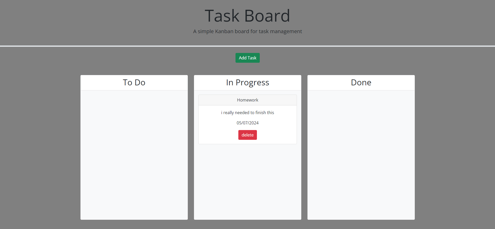

# Task-board-repo

## Description

a taskboard where you can make new tasks and move them where you need to during your process and if needed you can delete them as soon as you're done with them

## Screenshot

## Links

My Github

https://github.com/Amartin02/Task-board-repo

Link to deployed website:

https://amartin02.github.io/Task-board-repo/

## contributors

i was able to get this done with the help of my class mate victor and instructor ben
